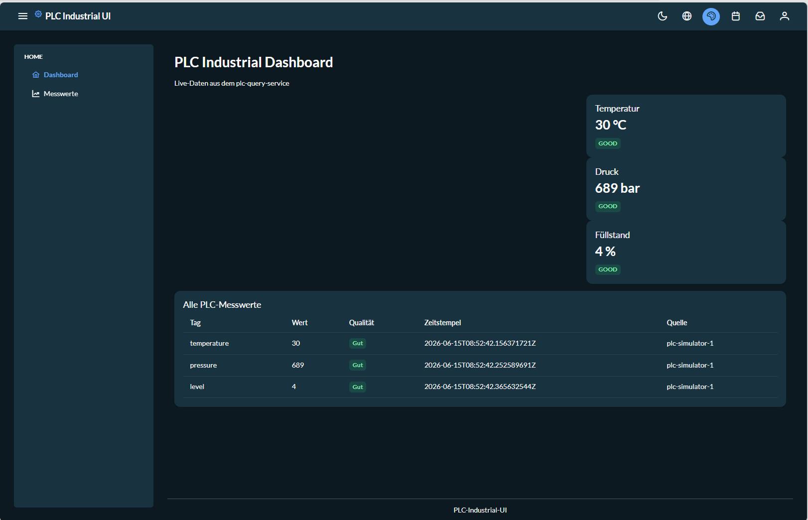
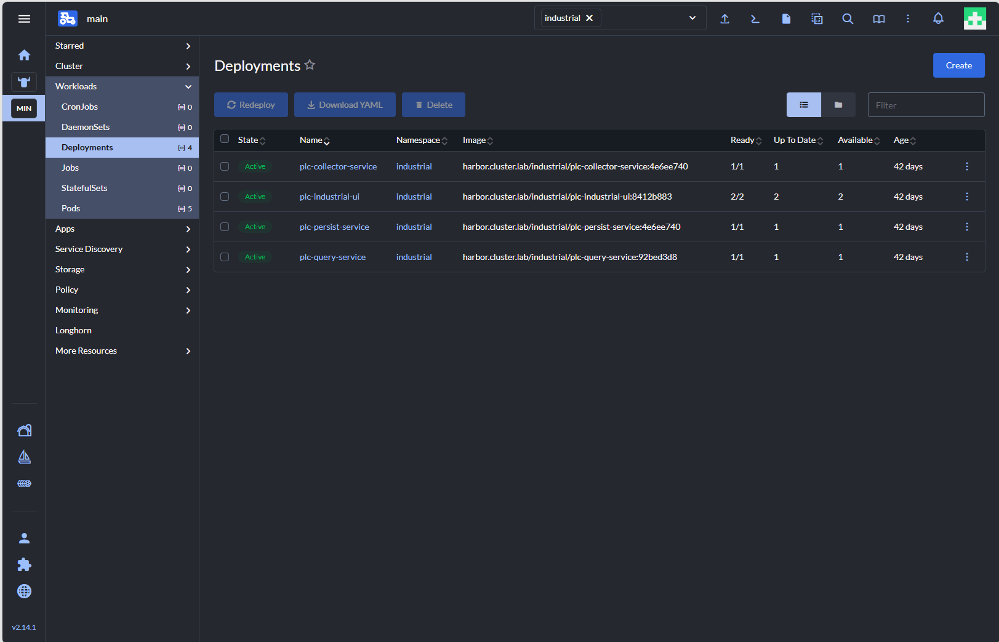
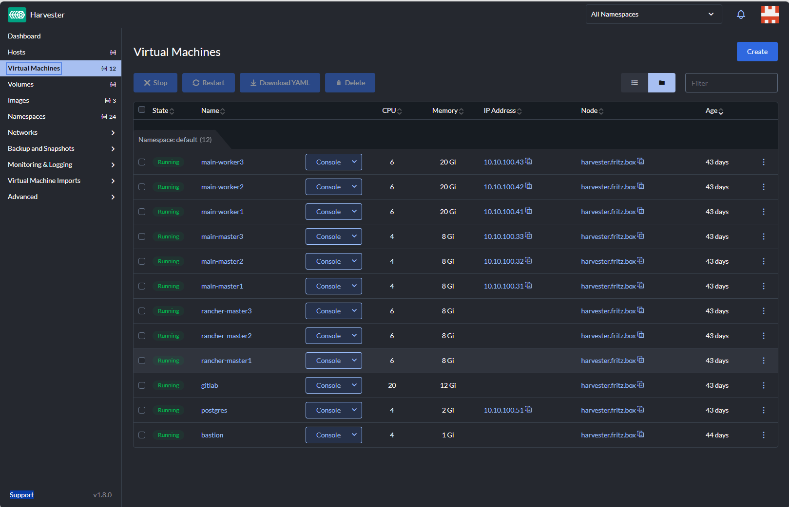

# Architecture

## Overview

The Industrial Data Platform Showcase is designed as a layered cloud-native architecture that covers the complete stack from infrastructure to business applications.

The architecture follows modern platform engineering principles and separates infrastructure concerns, platform services, and business functionality into clearly defined layers.

---

## High-Level Architecture

```text
+---------------------------------------------------------+
| Business Applications                                   |
|---------------------------------------------------------|
| Angular UI                                              |
| PLC Query Service                                       |
| PLC Persist Service                                     |
| PLC Collector Service                                   |
+---------------------------------------------------------+
| Platform Services                                       |
|---------------------------------------------------------|
| Kafka | Redis | PostgreSQL | Keycloak                  |
| Prometheus | Grafana | Loki                            |
+---------------------------------------------------------+
| Container Platform                                      |
|---------------------------------------------------------|
| Rancher                                                 |
| RKE2 Kubernetes                                         |
+---------------------------------------------------------+
| Infrastructure Layer                                    |
|---------------------------------------------------------|
| Harvester                                               |
| Virtual Machines                                        |
| Networking                                              |
| DNS / DHCP                                              |
| TLS Certificates                                        |
+---------------------------------------------------------+
| Hardware Layer                                          |
|---------------------------------------------------------|
| Compute | Storage | Network                             |
+---------------------------------------------------------+
```

---

## Application Architecture



The business application consists of multiple independent services.

### PLC Collector Service

Responsibilities:

- Connect to PLC devices using Apache PLC4X
- Read process values from industrial controllers
- Publish measurement events to Kafka
- Decouple field communication from downstream systems

### PLC Persist Service

Responsibilities:

- Consume Kafka events
- Store historical measurements in PostgreSQL
- Provide long-term persistence

### PLC Query Service

Responsibilities:

- Provide REST APIs
- Deliver current process values
- Deliver historical measurements
- Publish WebSocket updates
- Maintain current values in Redis

### Angular UI

Responsibilities:

- Real-time dashboards
- Historical trend analysis
- Authentication integration
- User interaction

---

## Data Flow Architecture

```text
PLC
 |
 v
PLC Collector Service
 |
 v
Kafka
 |
 +---------------------+
 |                     |
 v                     v
Persist Service    Query Service
 |                     |
 v                     v
PostgreSQL         Redis
 |                     |
 +----------+----------+
            |
            v
      WebSocket/STOMP
            |
            v
        Angular UI
```

---

## Security Architecture

Authentication and authorization are implemented using Keycloak.

```text
User
 |
 v
Keycloak
 |
 v
JWT Token
 |
 +-----------------------+
 |                       |
 v                       v
Angular UI         Backend Services
```

Features:

- OAuth2
- OpenID Connect
- JWT Tokens
- Role-based access control
- Centralized identity management

---

## Observability Architecture

Monitoring and logging are implemented using a dedicated observability stack.

```text
Applications
      |
      +-------------------+
      |                   |
      v                   v
Prometheus             Loki
      |                   |
      v                   v
        Grafana
```

Capabilities:

- Metrics collection
- Dashboard visualization
- Centralized logging
- Operational monitoring

---

## Deployment Architecture



The platform is deployed using GitOps principles.

```text
Developer
    |
    v
GitLab
    |
    v
CI/CD Pipeline
    |
    v
Harbor Registry
    |
    v
Fleet GitOps
    |
    v
Rancher / Kubernetes
```

Benefits:

- Reproducible deployments
- Automated rollouts
- Version-controlled infrastructure
- Consistent environments

---

## Infrastructure Architecture



The complete platform is hosted on a Harvester-based infrastructure.

Components:

- Physical server hardware
- Harvester virtualization platform
- Virtual machine management
- Virtual networking
- Kubernetes cluster nodes
- Platform services
- Business applications

This architecture demonstrates full-stack ownership from infrastructure to application level.

---

## Architectural Principles

The platform is based on the following principles:

- Cloud Native Architecture
- Event-Driven Communication
- Loose Coupling
- Infrastructure as Code
- GitOps Operations
- Security by Design
- Observability First
- Platform Engineering

---

## Summary

The Industrial Data Platform Showcase demonstrates how modern industrial applications can be implemented using cloud-native technologies while maintaining clear separation between infrastructure, platform services, and business functionality.

The architecture intentionally covers the complete technology stack to demonstrate expertise in software development, infrastructure, Kubernetes, DevOps, and industrial integration.
