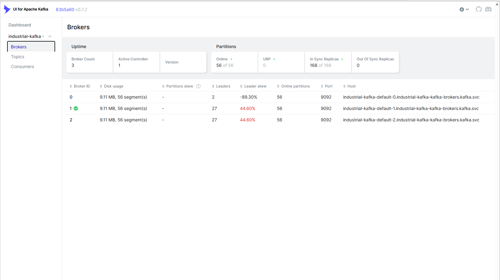
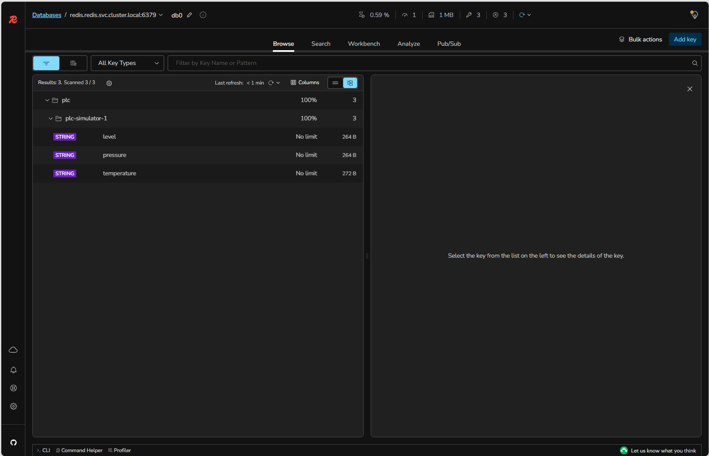
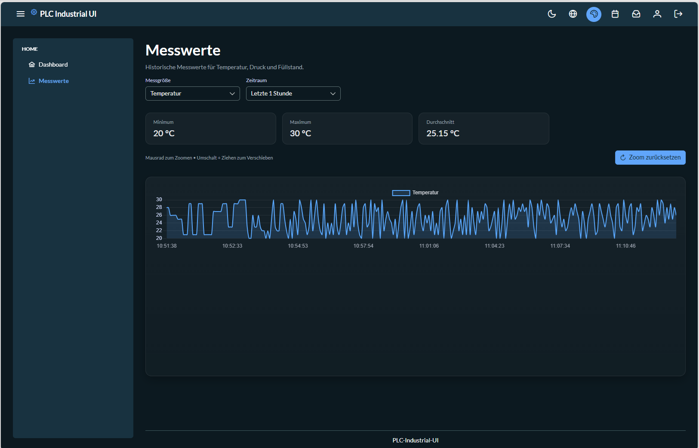

# Data Flow

## Overview

The Industrial Data Platform is based on an event-driven architecture.

Industrial process values are collected from PLC systems, transformed into events, distributed through a messaging platform, persisted for historical analysis, and delivered to users through real-time dashboards.

This architecture enables loose coupling, scalability, and clear separation of responsibilities.

---

## End-to-End Data Flow

```text
PLC
 |
 v
PLC Collector Service
 |
 v
Apache Kafka
 |
 +----------------------+
 |                      |
 v                      v
PLC Persist Service   PLC Query Service
 |                      |
 v                      v
PostgreSQL           Redis
 |                      |
 +----------+-----------+
            |
            v
      WebSocket/STOMP
            |
            v
        Angular UI
```

---

## Step 1: PLC Data Acquisition

The process begins with industrial PLC systems.

The showcase uses a PLC simulator, but the architecture is designed for real industrial controllers.

### Responsibilities

- Read process values
- Access industrial protocols
- Collect measurements
- Isolate field communication

### Technologies

- Apache PLC4X
- Apache Camel
- Spring Boot

---

## Step 2: PLC Collector Service

The PLC Collector Service acts as the gateway between industrial devices and the platform.

### Responsibilities

- Connect to PLCs
- Read configured tags
- Create measurement events
- Publish events to Kafka

### Benefits

- Centralized PLC connectivity
- Protocol abstraction
- Decoupled downstream processing

---

## Step 3: Event Streaming with Kafka



Kafka is the central communication backbone of the platform.

Every measurement is published as an event.

### Why Kafka?

Kafka provides:

- Loose coupling
- Scalability
- Reliability
- Event replay capabilities
- Independent service evolution

### Benefits

The PLC Collector does not need to know:

- Who stores data
- Who consumes data
- How many consumers exist

Kafka handles event distribution.

---

## Step 4: Historical Persistence

The PLC Persist Service subscribes to Kafka events.

### Responsibilities

- Consume measurement events
- Transform events into database records
- Store measurements in PostgreSQL

### PostgreSQL

PostgreSQL provides:

- Durable storage
- Historical analysis
- Structured queries
- Long-term retention

### Benefits

Historical data remains available even after application restarts.

---

## Step 5: Current Value Processing



The PLC Query Service also subscribes to Kafka events.

### Responsibilities

- Consume measurement events
- Maintain current process state
- Publish real-time updates

### Redis

Redis stores:

- Latest values
- Current process state
- Frequently accessed data

### Why Redis?

Benefits:

- Fast access
- Low latency
- Reduced database load

---

## Step 6: Real-Time Communication

The Query Service publishes updates through WebSocket/STOMP.

```text
Kafka Event
      |
      v
Query Service
      |
      v
WebSocket
      |
      v
Angular UI
```

### Benefits

- No browser polling required
- Immediate updates
- Efficient communication
- Better user experience

---

## Step 7: User Interface


The Angular frontend displays current measurements.




The Angular frontend displays:

- Current measurements
- Historical trends
- Real-time updates
- Operational dashboards

### Features

- Live dashboards
- History charts
- Authentication support
- Responsive UI

---

## Current Data vs Historical Data

The platform intentionally separates current state and historical data.

### Current State

Stored in Redis.

Purpose:

- Fast access
- Real-time dashboards
- Operational views

### Historical Data

Stored in PostgreSQL.

Purpose:

- Trend analysis
- Reporting
- Historical investigations

This separation improves both performance and maintainability.

---

## Event Model

All platform communication is based on measurement events.

Typical event information includes:

- Source
- Tag name
- Address
- Data type
- Value
- Timestamp
- Quality information

This creates a standardized data model across the platform.

---

## Architectural Benefits

The event-driven architecture provides:

### Loose Coupling

Services can evolve independently.

### Scalability

Consumers can scale separately.

### Reliability

Events remain available in Kafka.

### Flexibility

New consumers can be added without changing producers.

### Maintainability

Each service has a clearly defined responsibility.

---

## Summary

The Industrial Data Platform uses an event-driven architecture to transport industrial measurements from PLC devices to dashboards and historical storage.

Kafka acts as the central event backbone while Redis, PostgreSQL, and WebSocket communication provide optimized access patterns for operational and analytical workloads.

This design enables scalability, maintainability, and real-time visibility across the platform.
