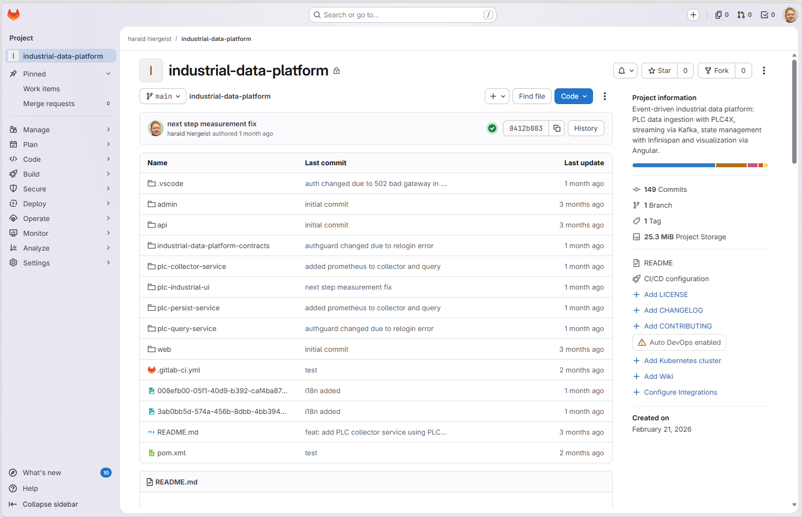
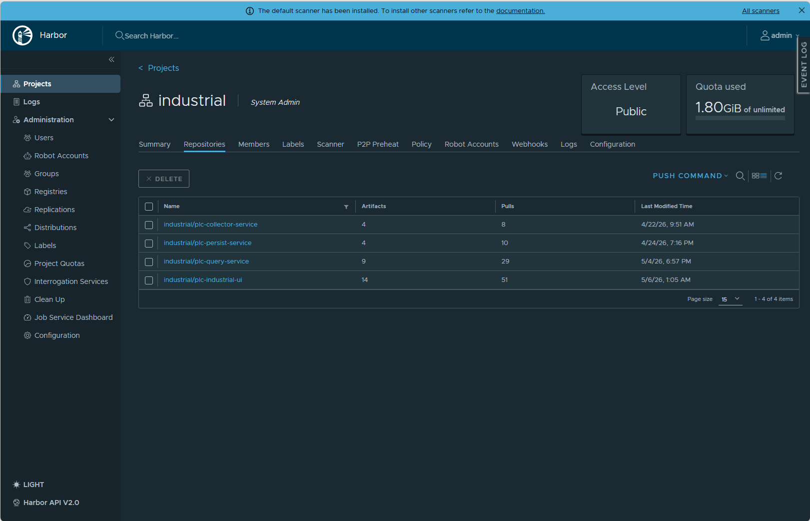

# Deployment

## Overview

The Industrial Data Platform is deployed using modern GitOps principles.

All application and infrastructure changes are managed through Git repositories and automatically propagated into the Kubernetes environment.

This approach provides reproducibility, traceability, automation, and operational consistency.

---

## Deployment Architecture

```text
Developer
    |
    v
GitLab Repository
    |
    v
GitLab CI/CD
    |
    v
Harbor Container Registry
    |
    v
Fleet GitOps
    |
    v
Rancher
    |
    v
RKE2 Kubernetes Cluster
    |
    v
Running Applications
```

---

## Deployment Philosophy

The platform follows several core principles.

### Infrastructure as Code

All infrastructure definitions are stored in Git.

Examples:

- Kubernetes manifests
- Ingress definitions
- Configurations
- Platform services

### GitOps

Git acts as the single source of truth.

Any change must be committed into version control before it reaches production.

### Automation

Build, packaging, publishing, and deployment are automated through CI/CD pipelines.

---

## Source Code Management



Application source code is maintained in GitLab repositories.

### Application Repository

industrial-data-platform

Contains:

- PLC Collector Service
- PLC Query Service
- PLC Persist Service
- Angular Frontend

### Infrastructure Repository

industrial-data-platform-infra

Contains:

- Kubernetes manifests
- Fleet definitions
- Platform service configurations
- Deployment resources

---

## Continuous Integration

GitLab CI/CD pipelines are used to build and validate application changes.

Typical pipeline stages include:

### Build

Compile source code.

### Test

Execute automated tests.

### Containerization

Build container images.

### Publish

Push images into Harbor.

Benefits:

- Consistent builds
- Automated validation
- Reduced manual effort

---

## Container Registry## Container Registry



Harbor acts as the central container registry.

### Responsibilities

- Container image storage
- Version management
- Image distribution

### Benefits

- Central image repository
- Secure image management
- Kubernetes integration

---

## GitOps Deployment


Fleet continuously monitors the infrastructure repository.

When changes are detected:

1. Fleet retrieves updated manifests
2. Kubernetes resources are reconciled
3. Desired state is applied automatically

### Benefits

- Automated deployments
- Version-controlled changes
- Reduced operational complexity
- Consistent environments

---

## Rancher

Rancher provides centralized Kubernetes management.

### Responsibilities

- Cluster administration
- Workload visibility
- Application management
- Operational monitoring

### Benefits

- Simplified Kubernetes operations
- Unified administration
- Improved visibility

---

## Kubernetes Deployment

Applications are deployed as Kubernetes workloads.

Typical resources include:

- Deployments
- Services
- Ingresses
- ConfigMaps
- Secrets

### Advantages

- Scalability
- Resilience
- Self-healing capabilities
- Standardized operations

---

## Ingress Architecture

External access is provided through Kubernetes Ingress resources.

Examples:

- PLC Web UI
- Keycloak
- Grafana
- Platform APIs

Features:

- TLS encryption
- Host-based routing
- Centralized access management

---

## Configuration Management

Application configuration is externalized.

Examples:

- Database connections
- Kafka configuration
- Redis configuration
- Environment-specific settings

Benefits:

- Environment independence
- Simplified operations
- Improved maintainability

---

## Secrets Management

Sensitive information is separated from application code.

Examples:

- Database credentials
- API keys
- TLS certificates
- Authentication secrets

Benefits:

- Improved security
- Controlled access
- Reduced risk of exposure

---

## Deployment Lifecycle

A typical deployment follows these steps.

```text
Code Change
      |
      v
Git Commit
      |
      v
GitLab Pipeline
      |
      v
Container Build
      |
      v
Harbor Registry
      |
      v
Fleet Synchronization
      |
      v
Kubernetes Deployment
      |
      v
Running Application
```

---

## Operational Benefits

The deployment model provides:

### Reproducibility

Every deployment can be recreated from Git.

### Traceability

Every change is version controlled.

### Automation

Minimal manual deployment effort.

### Consistency

Development, test, and production environments follow the same deployment process.

### Reliability

Automated reconciliation ensures desired state is maintained.

---

## Summary

The Industrial Data Platform uses a GitOps-based deployment model built around GitLab, Harbor, Fleet, Rancher, and Kubernetes.

This approach enables automated, reproducible, and scalable deployments while maintaining full visibility and control over infrastructure and application changes.
