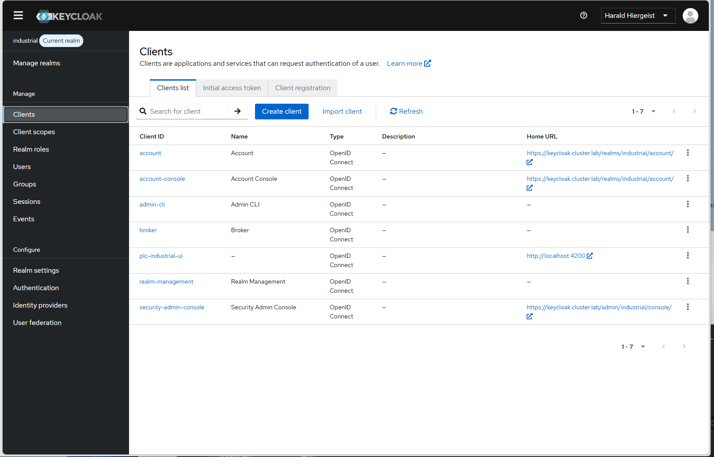

# Security

## Overview

Security is a fundamental aspect of the Industrial Data Platform.

The platform implements modern authentication and authorization mechanisms based on industry standards and provides centralized identity management through Keycloak.

The goal is to ensure secure access to applications, APIs, and platform resources while maintaining a consistent user experience.

---

## Security Architecture

```text
User
 |
 v
Angular UI
 |
 v
Keycloak
 |
 v
JWT Token
 |
 +-----------------------+
 |                       |
 v                       v
PLC Query Service   Platform Services
```

Authentication is centralized and based on OAuth2 and OpenID Connect standards.

---

## Security Goals

The platform is designed to provide:

- Secure authentication
- Centralized identity management
- Token-based authorization
- Protected APIs
- Secure communication
- Role-based access control

---

## Identity Provider



### Keycloak

Keycloak serves as the central identity and access management platform.

Responsibilities:

- User authentication
- User management
- Session management
- Role management
- Token generation

Benefits:

- Centralized security management
- Industry-standard protocols
- Single Sign-On capabilities
- Extensible architecture

---

## Authentication

Authentication is performed through Keycloak.

Typical authentication flow:

```text
User Login
     |
     v
Keycloak
     |
     v
Access Token
     |
     v
Angular UI
```

After successful authentication, the user receives a JWT access token.

---

## OpenID Connect

The platform uses OpenID Connect (OIDC) for user authentication.

Benefits:

- Standardized authentication
- Identity federation support
- Interoperability
- Secure user identity management

---

## OAuth2

OAuth2 is used for authorization.

Benefits:

- Token-based security
- Delegated authorization
- Secure API access
- Widely adopted industry standard

---

## JWT Tokens

Authenticated users receive JSON Web Tokens (JWT).

JWT tokens contain:

- User identity
- Roles
- Permissions
- Session information

Benefits:

- Stateless authentication
- Efficient authorization
- Scalable architecture

---

## Frontend Security

The Angular application integrates directly with Keycloak.

Responsibilities:

- User login
- User logout
- Token management
- Protected routes
- Secure API access

Benefits:

- Consistent user experience
- Centralized authentication
- Reduced application complexity

---

## Backend Security

Backend services validate JWT tokens.

Responsibilities:

- Token verification
- Role validation
- Request authorization
- Resource protection

Benefits:

- Secure API access
- Centralized security model
- Consistent authorization

---

## API Protection

Protected APIs require valid access tokens.

Typical flow:

```text
User
  |
  v
Angular UI
  |
  v
JWT Token
  |
  v
REST API
```

Requests without valid credentials are rejected.

---

## Role-Based Access Control

The platform supports role-based authorization.

Examples:

- Administrator
- Operator
- Viewer

Benefits:

- Fine-grained permissions
- Reduced security risk
- Controlled access

---

## Transport Security

Communication between components is protected using TLS.

Examples:

- Web UI access
- Keycloak access
- API communication
- Ingress traffic

Benefits:

- Data confidentiality
- Data integrity
- Protection against interception

---

## Secrets Management

Sensitive information is not stored directly in application source code.

Examples:

- Database passwords
- Client secrets
- Certificates
- Authentication credentials

Benefits:

- Improved security
- Reduced exposure risk
- Better operational practices

---

## Security Principles

The platform follows several security principles.

### Least Privilege

Users and services receive only required permissions.

### Defense in Depth

Security controls exist at multiple layers.

### Centralized Identity Management

Authentication is handled by a dedicated platform service.

### Secure by Default

Protected resources require explicit authorization.

---

## Summary

The Industrial Data Platform uses Keycloak, OAuth2, OpenID Connect, JWT tokens, and TLS to implement a modern security architecture.

Centralized identity management, role-based access control, and secure API communication provide a strong foundation for secure industrial applications.
