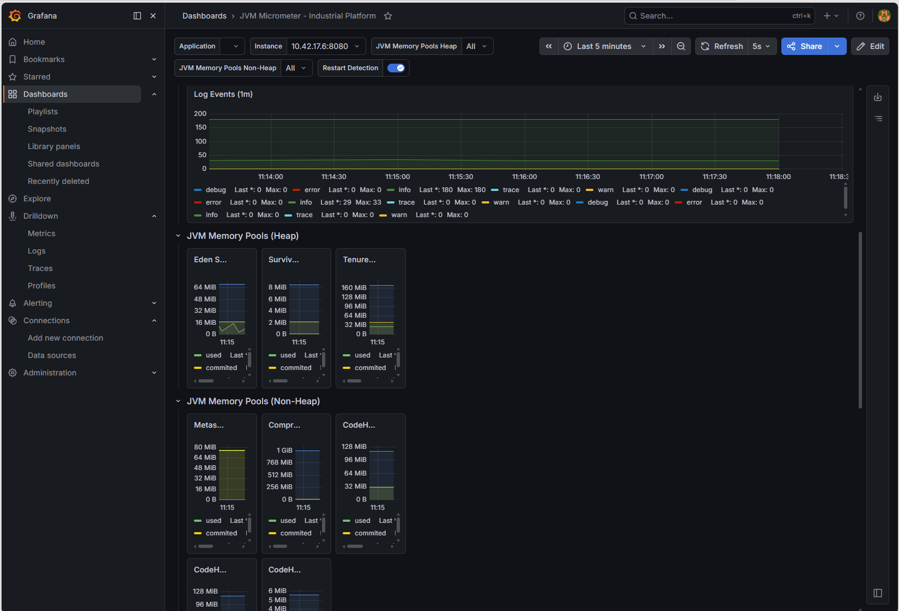

# Observability

## Overview

Observability is a key aspect of operating modern cloud-native applications.

The Industrial Data Platform includes a dedicated observability stack that provides metrics, dashboards, health monitoring, and centralized logging.

The objective is to ensure operational visibility, simplify troubleshooting, and improve platform reliability.

---

## Observability Architecture

```text
Applications
      |
      +---------------------+
      |                     |
      v                     v
Prometheus              Loki
      |                     |
      v                     v
            Grafana
```

The observability stack combines metrics, logs, and visualization capabilities into a unified operational platform.

---

## Observability Goals

The platform is designed to provide:

- Operational visibility
- Application monitoring
- Infrastructure monitoring
- Centralized logging
- Performance analysis
- Faster troubleshooting
- Health monitoring

---

## Metrics Collection

### Spring Boot Actuator

All backend services expose operational metrics using Spring Boot Actuator.

Examples:

- JVM memory usage
- CPU utilization
- Request statistics
- Application health
- Thread information

Benefits:

- Standardized metrics
- Built-in monitoring support
- Operational transparency

---

## Prometheus

Prometheus is responsible for collecting and storing metrics.

### Responsibilities

- Metrics scraping
- Time-series storage
- Query execution
- Monitoring integration

### Collected Information

Examples:

- Service availability
- JVM metrics
- HTTP request metrics
- Resource consumption
- Custom application metrics

Benefits:

- Reliable monitoring
- Historical metric analysis
- Operational insights

---

## Grafana



Grafana provides visualization and dashboard capabilities.

### Responsibilities

- Dashboard creation
- Metrics visualization
- Operational reporting
- Platform monitoring

### Typical Dashboards

Examples:

- Application overview
- JVM monitoring
- Resource consumption
- Service health
- Request statistics

Benefits:

- Improved visibility
- Faster analysis
- Operational transparency

---

## Centralized Logging

### Loki

Loki acts as the centralized logging platform.

Responsibilities:

- Log aggregation
- Log storage
- Log search
- Operational troubleshooting

Benefits:

- Centralized log access
- Simplified diagnostics
- Unified operational view

---

## Application Logging

All services produce structured application logs.

Typical log information includes:

- Startup events
- Application errors
- Warnings
- Processing information
- Operational events

Benefits:

- Improved traceability
- Easier troubleshooting
- Better operational awareness

---

## Health Monitoring

Applications expose health endpoints through Spring Boot Actuator.

Examples:

- Service availability
- Dependency status
- Application readiness
- Application liveness

Benefits:

- Automated health verification
- Improved reliability
- Faster incident detection

---

## Platform Monitoring

The observability stack monitors not only applications but also platform components.

Examples:

- Kubernetes workloads
- Infrastructure resources
- Platform services
- System utilization

Benefits:

- End-to-end visibility
- Capacity planning
- Operational control

---

## Troubleshooting Workflow

A typical troubleshooting process follows these steps.

```text
Issue Detected
      |
      v
Grafana Dashboard
      |
      v
Metric Analysis
      |
      v
Loki Logs
      |
      v
Root Cause Analysis
```

Benefits:

- Faster problem resolution
- Reduced downtime
- Improved operational efficiency

---

## Operational Benefits

The observability stack provides:

### Visibility

Understand system behavior in real time.

### Reliability

Detect issues before they become critical.

### Performance Insights

Identify bottlenecks and optimization opportunities.

### Faster Troubleshooting

Correlate metrics and logs efficiently.

### Operational Excellence

Support continuous improvement and platform maturity.

---

## Demonstrated Capabilities

The observability solution demonstrates practical experience with:

- Spring Boot Actuator
- Prometheus
- Grafana
- Loki
- Kubernetes Monitoring
- Operational Dashboards
- Centralized Logging
- Cloud-Native Operations

---

## Summary

The Industrial Data Platform includes a complete observability stack based on Prometheus, Grafana, Loki, and Spring Boot Actuator.

This provides comprehensive monitoring, centralized logging, and operational visibility across the entire platform, enabling reliable and maintainable cloud-native operations.
